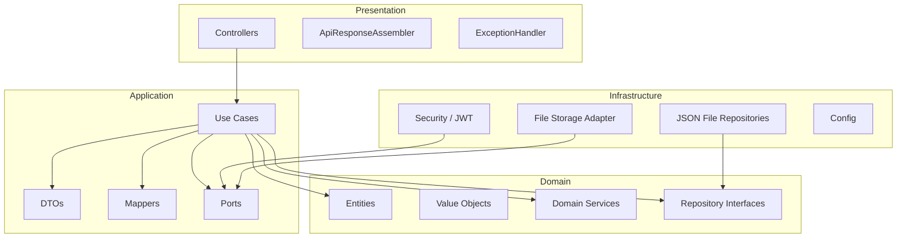
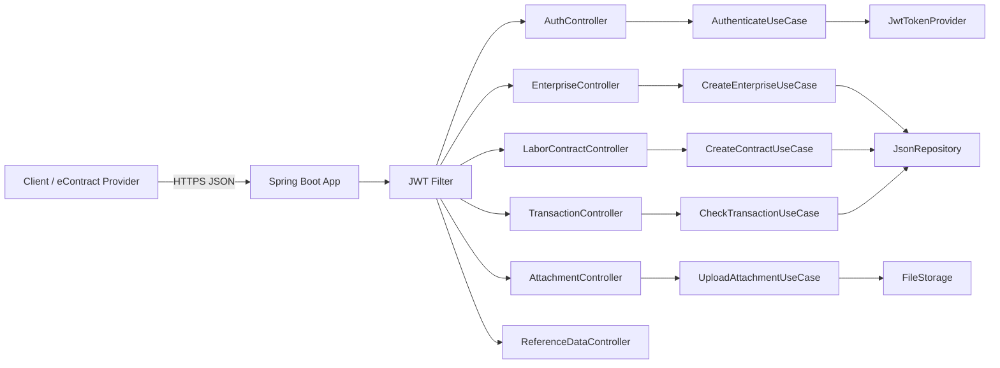

# System Architecture

## Overview

Clean Architecture with four concentric layers: Domain, Application, Infrastructure, Presentation.

## Layer Diagram (Mermaid)

## Component Diagram

## Data Flow: Create Labor Contract

1. Client POST `/hdld/ThemMoiHopDongLaoDong` with JWT
2. `JwtAuthenticationFilter` validates token
3. `LaborContractController` receives `CreateContractRequest`
4. `CreateContractUseCase` maps DTO to domain entities
5. `ContractDomainService` validates business rules
6. `JsonLaborContractRepository` persists JSON to folder
7. Use case returns `ApiResponse` with `transaction_id`
8. Controller assembles response

## Data Flow: Upload Attachment

1. Client POST `/hdld/UploadFileHopDong` with Base64 PDF
2. `AttachmentController` receives `UploadAttachmentRequest`
3. `UploadAttachmentUseCase` decodes Base64
4. `FileStoragePort` adapter writes file to `./data/attachments`
5. `JsonAttachmentRepository` records metadata
6. Response returns `uuid_file` and `ma_giao_dich`

## Security

- HTTPS only
- JWT Bearer tokens; `Authorization: Bearer <token>`
- Token expiry per platform spec (3600s in sample)
- Spring Security filter chain secures all endpoints except `/hdld/login`
- Password change requires valid token + old password verification

## Swagger Integration

- SpringDoc OpenAPI v2
- Annotations on controllers and DTOs
- Accessible at `/swagger-ui.html`
- Grouped by tags: Auth, Enterprise, Contract, Attachment, Transaction, Reference Data

## Temporary Storage

Until database deployment:
- Each aggregate stores as individual JSON file
- File naming: `{aggregate-type}/{uuid}.json`
- Base path configurable via `storage.base-path`
- No concurrent write guarantees (acceptable for dev phase)

## Unresolved Questions
- Will the production persistence be RDBMS or document store?
- Is Redis needed for token blacklisting on password change?
